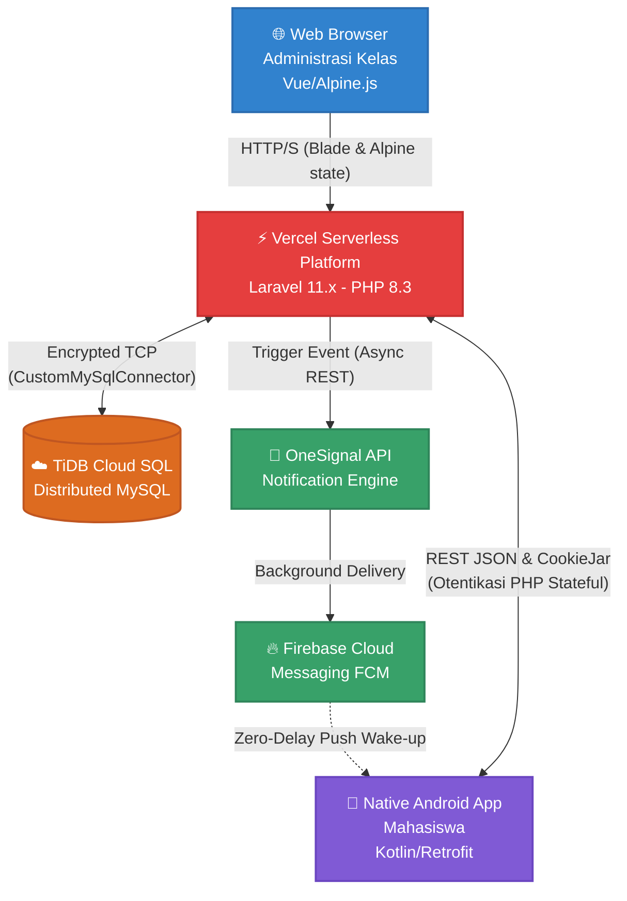
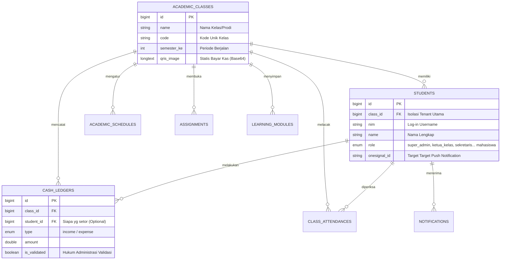

# 🌌 KelasHUB — Enterprise-Grade Class Operational Ecosystem

<div align="center">

[](https://klas-hub.vercel.app)
[](https://laravel.com)
[](https://tidbcloud.com)
[](https://onesignal.com)
[](android-webview/)
[](resources/css/app.css)

**Sistem Administrasi Sentral Kelas Perkuliahan (SaaS) Berperforma Ekstrim, Dirancang untuk Agility, Transparansi Dana, dan Konektivitas Mahasiswa Real-Time.**

[🚀 Live Demo](https://klas-hub.vercel.app) | [📖 Dokumentasi API](docs/API.md) | [📦 Unduh APK](android-webview/) | [📋 Changelog](CHANGELOG.md) | [🤝 Berkontribusi](CONTRIBUTING.md)

</div>

---

## 📌 Pengenalan Proyek (Project Overview)

**KelasHUB v2.3.0** adalah platform *Management as a Service (MaaS)* tingkat *enterprise* yang dirancang khusus untuk memusatkan operasional kelas perkuliahan. KelasHUB mengotomatisasi pencatatan kehadiran, transparansi keuangan kelas (kas), dan repositori modul belajar (LMS) ke dalam satu wadah *cloud* yang saling terhubung secara mulus.

Platform ini hadir dalam arsitektur **Hybrid Stateless Monolith**:
1. **Web Dashboard (Desktop)**: Dibangun dengan Laravel Blade, TailwindCSS v4, dan Alpine.js 3, menawarkan antarmuka administrator *SPA-like* tanpa muat ulang halaman secara penuh (*full-page reload*).
2. **Native Android App (Mobile)**: Dibangun murni dengan Kotlin (MVVM) dan XML Material Design, memanfaatkan komunikasi Retrofit/OkHttp yang mensinkronisasi data waktu nyata dan mengirimkan notifikasi *Push* lintas ruang.

---

## 🏗️ Arsitektur Infrastruktur & Aliran Data (Architecture Design)

Infrastruktur KelasHUB direkayasa agar dapat berjalan pada batasan memori yang ketat di Vercel *Edge Network* (<128MB RAM dan siklus mati 10 detik).



---

## 🗄️ Entitas Data & Isolasi Penyewa-Ganda (Multi-Tenant ERD)

Guna memastikan tidak ada *Insecure Direct Object Reference* (IDOR) lintas universitas/kelas, semua tabel terikat kuat menggunakan Trait `BelongsToClass` yang menjadi fondasi pertahanan aplikasi ini.



---

## ✨ Fitur Inovasi (Enterprise Solutions)

1. **Multi-Tenant Global Scopes (Zero-Bleed Data Isolation)**
   Seluruh panggilang *Eloquent ORM* PHP dipantau statis dari level `boot()` agar menyisipkan kondisi `WHERE class_id = X`. Mutlak melindungi privasi data uang dan absen agar tidak bocor lintas institusi.

2. **Gamifikasi Kehadiran (*Gamified 3-Strike Penalties*)**
   Meninggalkan sistem kertas usang; KelasHUB memberikan skor sisa "3 Nyawa (Keringanan Absen)". Terkikisnya skor kehadiran memicu alarm Android *(DICEKAL)* sebagai intervensi langsung untuk mengurus izin ke pengurus prodi.

3. **0-RAM Limitless Data Exporter via `php://output`**
   Mengakali infrastruktur Vercel gratis yang mencekik memori server (Max 128MB). KelasHUB mendelegasikan ekspor buku kas Excel CSV *(Ribuan Transaksi Berjalan)* dengan metode *chunking stream* laravel (`DB::table()->lazy()`) yang melancarkannya ke peramban tanpa jeda beban *RAM*.

4. **Sistem Gudang Awan Tak Terbatas (*Base64 File Injection Storage*)**
   Modul Makalah PDF mahasiswa tak direkam pada memori statis peladen Linux yang riskan terhapus pasca OS dinonaktifkan (Vercel Sleep Node). Vercel mengkompresi PDF menjadi string Kriptografi *LONGTEXT Base64* untuk bersarang abadi bersama Tabel Riwayat MySQL. Bebas URL Kedaluwarsa!

5. **Pukulan Latar Belakang Mendadak (*Zero-Delay Push over OneSignal*)**
   Aplikasi klien (Android Kotlin) berkolaborasi dengan *Push Cloud* OneSignal untuk menerima getaran darurat secara instan *(Zero-Delay)* sewaktu Sekretaris di Dasbor Desktop memublikasikan Berita Kelas Mendesak.

---

## 🛠️ Persyaratan Lingkungan (Environment Prerequisites)

Untuk menjalankan KelasHUB dalam komputasi lokal, penuhi dependensi dasar ini:

- **PHP**: ^8.3 (Ditenagai fitur sintaks asinkron Laravel 11x)
- **Node.js**: >= 20.x (Mesin pemicu Vite & TailwindCSS JS Compiler)
- **Composer**: ^2.6
- **Database Relasional**: Engine MySQL ^8.0 / MariaDB, kami anjurkan **TiDB Cloud** 
- **Java JDK & Android Studio**: JDK 17 yang menyokong *Gradle 8.7+* diperlukana untuk meretas rilis *Mobile App*.

---

## 🚀 Panduan Pengisian Bahan Bakar (Quick Start Dev-Setup)

### Tahap 1: Membangkitkan Peladen Node Gateway

1. **Kloning Proyek ke Lapangan Terisolasi**
   ```bash
   git clone https://github.com/gmailtesid-stack/KlasHUB.git
   cd KlasHUB
   ```

2. **Muat Rangkaian Persenjataan Utama (Backend & Frontend)**
   ```bash
   composer install
   npm install
   ```

3. **Duplikasi Kode Tatanan Otorisasi (Env Params)**
   Gandakan kerangka berkas `.env.example` ke dalam bentuk `.env`.
   ```bash
   cp .env.example .env
   php artisan key:generate
   ```

4. **Penyuntikan Pondasi Database (*Seeding Injections*)**
   Eksekusi migrasi tabel dan datakan 30 data DUMMY Mahasiswa beserta *Master Schedule* kelas simulasi *(Sangat direkomendasikan untuk uji coba UI Android)*:
   ```bash
   php artisan migrate:refresh --seed --class="Database\Seeders\DummyClassSeeder"
   ```

5. **Letuskan Reaktor Simulasi Ganda (Local Host Server)**
   Kami mengemas skrip *Composer* untuk meluncurkan Server PHP dan Watcher Vite secara bersamaan tanpa kerepotan membagi dua layar Terminal:
   ```bash
   npm run dev
   # (Sebagai alternatif manual, Anda bisa memakai dua tab terminal: 'php artisan serve' dan 'npm run dev')
   ```
   **🟢 Server Web Dashboard hidup di:** `http://localhost:8000`

### Tahap 2: Membangkitkan Senjata Gawai (Android Client Assembly)
Modul native dipisahkan kaku dari kernel Backend (Bukan Aplikasi React Native Monolit!): 
Buka ruang *Android Studio* arahkan pada folder `/android-webview`. Sinkronkan perakitan (Sync Gradle with Project Files). Arahkan mata angin Base URL Konstanta pada fail `ApiClient.kt` menuju tautan `http://10.0.2.2:8000/` bila Anda melatihnya dari Emulator Android, atau biarkan tetap jika sistem menuju *Produksi*.

---

## 🔐 Pemetaan Variabel Rahasia Ekosistem (*Crucial Env Map*)

Kegagalan meletakkan format variabel di bawah berkas `.env` akan menimbulkan Ledakan Beruntun (Crash Lintas Modul):

| Ruang Konstanta (*ENV KEY*) | Esensi (Definisi & Efek Parameter) |
|---|---|
| `SESSION_DRIVER` | Wajib `cookie` atau `database`. Melarang `file` (Menimbulkan Bencana Web Log Out Loop di sistem Serverless Read-Only disk!). |
| `MYSQL_ATTR_SSL_CA` | Target muat Kredensial *TiDB Handshake*. Standar operasi harus menuju lokus: `cacert.pem`. |
| `ONESIGNAL_APP_ID` | Kode identitas radar Platform Push Notifications (Milik Android App). |
| `ONESIGNAL_REST_API_KEY` | Kredensial rahasia transmisi jaringan *Backend-to-OneSignal-Cloud*. Beresiko fatal bila tertampil (Spam exploit risiko tinggi). |

---

## 📁 Navigasi Turunan Infrastruktur (Documentation Map)

Jelajahi panduan mutlak standar organisasi yang dikelompokkan secara terstruktur di direktorat `/docs`:

| Topik Spesifik | Tautan Menuju Panduan Master |
|---|---|
| Kontrak Arsitektur Titik Hubungan | [📖 **OpenAPI Endpoint Reference (API.md)**](docs/API.md) |
| Batasan Jaringan Awan Ekstrem | [🧠 **Anatomi Hybrid Teknis (TECHNICAL.md)**](docs/TECHNICAL.md) |
| SOP Ekosistem Kotlin Seluler | [📱 **Pedoman Pembangunan Klien Native**](docs/MOBILE_NATIVE_GUIDE.md) |
| Desain Kebutuhan Matriks Agile | [🎯 **Product Requirements Document (PRD)**](docs/PRD.md) |
| Buku Tata Tertib Alur Repositori | [🤝 **Aturan Kontribusi PR Terbuka (CONTRIBUTING.md)**](CONTRIBUTING.md) |

---

<div align="center">
    <strong>"Evolusi Administrasi Kehidupan Kampus; Bersinggah di Awan, Bergetar di Sakumu."</strong>
    <br><br>
    <i>Hak Cipta © 2026 WaveProject.ID - Terbuka Publik (MIT License).</i>
</div>
