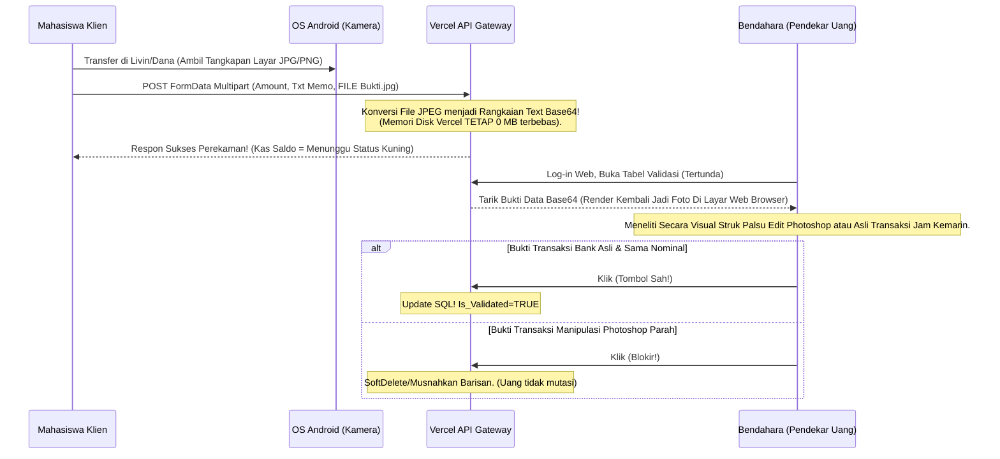
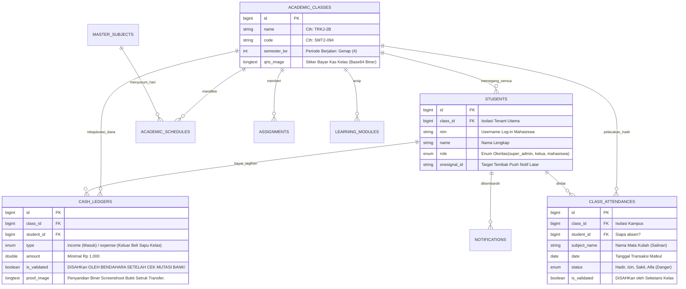

# PRODUCT REQUIREMENTS DOCUMENT (PRD) & MASTER BLUEPRINT
**Proyek:** KelasHUB - Enterprise Class Management SaaS (Hybrid Web & Native Kotlin Mobile)
**Status Dokumen:** FINAL / PRODUCTION MASTERS
**Versi Rilis:** v2.3.0 ("Zero-Delay Mobility System")
**Terakhir Diperbarui:** 4 Juni 2026
**Penulis Utama:** Chief Technology Officer, WaveProject.ID

---

## DAFTAR ISI KONTEN (TABLE OF CONTENTS)
1. [Ringkasan Eksekutif (Executive Summary)](#1-ringkasan-eksekutif-executive-summary)
2. [Peluang Pasar & Model Bisnis (Market Opportunity)](#2-peluang-pasar--model-bisnis-market-opportunity)
3. [Profil Persona Pengguna Eksplisit (Detailed User Personas)](#3-profil-persona-pengguna-eksplisit-detailed-user-personas)
4. [Spesifikasi Arsitektur Sistem Hibrida (Hybrid Architecture Specs)](#4-spesifikasi-arsitektur-sistem-hibrida-hybrid-architecture-specs)
5. [Spesifikasi Frontend: Web Dashboard (Tailwind + Alpine)](#5-spesifikasi-frontend-web-dashboard-tailwind--alpine)
6. [Spesifikasi Klien: Android Native App (Kotlin Jetpack MVVM)](#6-spesifikasi-klien-android-native-app-kotlin-jetpack-mvvm)
7. [Spesifikasi Backend & API (Vercel Serverless Laravel 11.x)](#7-spesifikasi-backend--api-vercel-serverless-laravel-11x)
8. [Matriks Otorisasi Keamanan Siber (Cybersecurity Authorization)](#8-matriks-otorisasi-keamanan-siber-cybersecurity-authorization)
9. [Persyaratan Fungsional / User Stories (Epic Breakdown)](#9-persyaratan-fungsional--user-stories-epic-breakdown)
10. [Bagan Alir Sistem Inti (Core Business Flowcharts)](#10-bagan-alir-sistem-inti-core-business-flowcharts)
11. [Desain Skema Database Terperinci (Database ERD & Schema)](#11-desain-skema-database-terperinci-database-erd--schema)
12. [Metrik Toleransi Performa (SLA & NFRs)](#12-metrik-toleransi-performa-sla--nfrs)
13. [Peta Jalan Rilis (Release Roadmap)](#13-peta-jalan-rilis-release-roadmap)

---

## 1. RINGKASAN EKSEKUTIF (EXECUTIVE SUMMARY)

### 1.1 Visi Produk
KelasHUB bukan sekadar aplikasi akademik; ini adalah *Operating System (OS)* untuk birokrasi ruang kelas perguruan tinggi. Sebuah ekosistem tertutup (SaaS - *Software as a Service*) yang menjamin transparansi absolut aliran dana kas kelas, ketepatan hukum absensi mahasiswa, dan pengiriman informasi kecepatan cahaya tanpa intervensi pihak pengurus yang melelahkan.

### 1.2 Problematika Berjalan (The Status Quo Pains)
Saat ini, orkestrasi sebuah kelas berkapasitas 50-80 orang mengandalkan penambalan kacau (patchwork) dari berbagai aplikasi:
- **Ledger Kertas/GSheet:** Catatan pembayaran uang bendahara berserakan dan sering tidak akurat, menciptakan defisit.
- **Absen Google Form:** Mahasiswa mudah mencurangi absen, dan data tidak terekap sempurna dengan aturan "Batas 3 Alfa".
- **Grup WhatsApp:** Pesan penugasan dosen tenggelam oleh ratusan *chat* sampah (*spam*), membuat instruksi vital terlewatkan.

### 1.3 Resolusi (The KelasHUB Engine)
Sistem memusatkan permasalahan tersebut ke dalam arsitektur ganda (Dual-Platform Architecture):
1. **Pusat Komando Web (Desktop):** Membawa kendali super besar yang menaungi Dasbor Pengurus BEM Kelas (Super Admins, Sekretaris, Bendahara) layaknya kokpit perbankan daring.
2. **Klien Militer Android (Mahasiswa):** Aplikasi *Native* (Bukan WebView sampah) yang dipersenjatai dengan *OneSignal Background Sockets* (Push Notifications Tembus Layar). Memaksa kepatuhan mahasiswa dengan fitur Hukuman Banned ("Status DICEKAL") yang mengunci aplikasi berwarna merah jika absen mangkir lebih dari 3 kali.

---

## 2. PELUANG PASAR & MODEL BISNIS (MARKET OPPORTUNITY)

### 2.1 Analisis Makro
Terdapat jutaan mahasiswa aktif yang direpresentasikan dalam puluhan ribu unit "Kelas/Rombongan Belajar (Rombel)" di seluruh nusantara. Setiap Rombel setidaknya dipungut iuran finansial wajib oleh ketua kelas untuk fotokopi atau kas himpunan. Memfasilitasi hal ini dengan SaaS khusus menghapus kemungkinan korupsi kelas berskala mikro.

### 2.2 Go-To-Market (GTM) Strategy
Sistem di-deliver kepada Ketua Institusi / Himpunan sebagai B2B. Administrator Kelas memiliki wewenang menginjeksi 30-50 akun Mahasiswa sekaligus, kemudian Mahasiswa diarahkan untuk mengunduh `.APK` dari Play Store secara paksa demi memenuhi tuntutan akademis. Produk menyebar layaknya api lewat efek jaringan tertutup *(Closed-Network Network Effect)*.

---

## 3. PROFIL PERSONA PENGGUNA EKSPLISIT (DETAILED USER PERSONAS)

Sistem dirancang melayani hirarki piramida yang sangat spesifik dan kaku.

### 3.1 Sang Otoritas Mutlak (Ketua Kelas / Super Admin)
- **Tingkat Akses:** Level Tertinggi. (`role: ketua_kelas` / `role: super_admin`)
- **Perilaku Digital:** Sering menganalisa dari Laptop PC. Membutuhkan tabel yang lebar dan fungsi validasi massal.
- **Goals Utama:** Menentukan tanggal awal Matrikulasi, mendaftarkan Jadwal Kuliah Master, mendaftar NIM Mahasiswa baru, dan menjatuhkan palu sidang penyetujuan laporan absen bawahan.
- **Pain Points:** Lelah ditagih dosen laporan persentase kehadiran anak-anak nakal; lelah mengaudit kerjaan Bendahara secara manual tiap minggu.

### 3.2 Si Penjaga Harta (Bendahara Kelas)
- **Tingkat Akses:** Level Admin Keuangan. (`role: bendahara`)
- **Perilaku Digital:** Membuka Dasbor Web untuk mengecek mutasi transfer, mengunggah ulang Banner Bukti Bayar Bank/QRIS. 
- **Goals Utama:** Mencatat "Pemasukan Uang Kas" dan "Pengeluaran". Melakukan *Audit & Approvals* terhadap uang yang diaku-aku dikirim oleh mahasiswa (Menganalisa gambar Struk Bukti).
- **Kebutuhan Ekstrem:** Butuh eksport CSV/Excel jutaan transaksi secara sekejap untuk diprint ke Dosen Wali. Bebas Timeout/OOM.

### 3.3 Si Baling-Baling Berita (Sekretaris Akademik)
- **Tingkat Akses:** Level Admin Akademis. (`role: sekretaris`)
- **Goals Utama:** Mengunggah file PDF (Materi dari Dosen) secara masif. Memencet tombol **Sinyal Push Alarm** kepada mahasiswa jika kelas dimajukan mendadak. Memutuskan siapa yang *"ALFA"* hari ini di layar Validasi.

### 3.4 Si Pelayan Sistem (Klien Mahasiswa)
- **Tingkat Akses:** Level Dasar (Read-Only Consumer). (`role: mahasiswa`)
- **Peranti Sentral:** Memilih memakai HP Android Native (Google Pixel/Samsung dll) di kelas/jalan.
- **Batasan (Constraints):** Mereka diharamkan melihat uang transfer orang lain, dilarang mendelete absen, dan terkurung dalam ancaman Sisa Sistem 3-Nyawa (3 Strikes Gamification). Mereka hanya bisa bermohon mengirim Gambar Bukti Kas dan Teks Alasan Izin Sakit yang menanti di-stempel Pengurus Web.

---

## 4. SPESIFIKASI ARSITEKTUR SISTEM HIBRIDA (HYBRID ARCHITECTURE SPECS)

Keseluruhan solusi dikerahkan dengan konfigurasi tanpa-peladen *(Pure Serverless Architecture)* membelah API dan Web Monolith. Sistem tidak menggunakan Vultr/DigitalOcean VPS, melainkan merangkul komputasi Node Edge.

### 4.1 Topology Diagram
```mermaid
flowchart TB
    subgraph Mobile Endpoint
        M_APK(Native Kotlin App)
        M_OS[OneSignal SDK Push]
    end

    subgraph Web Endpoint
        W_DOM(Vue / Alpine.js Dashboard)
        W_CSS(Tailwind v4 Stealth Mode)
    end
    
    subgraph Vercel Edge Serverless
        L_ROUT(Laravel 11 Router)
        L_CTRL(Monolithic Controllers)
        L_API(API JSON Dumper)
        L_GZN(Guzzle Broadcast Proxy)
    end

    subgraph Cloud Storage Infrastructure
        T_SQL[(TiDB Core RDBMS Cluster)]
        T_BASE((Raksasa Base64 LongText Data))
    end
    
    %% Connections Web
    W_DOM -->|HTTP/S Get Request| L_ROUT
    L_ROUT -.->|Render Blade / HTML Res| W_DOM
    
    %% Connections Mobile
    M_APK -->|REST API (JSON Payload)| L_API
    L_API -.->|Set-Cookie Session| M_APK
    L_API -.->|Trigger Async Guzzle| L_GZN
    L_GZN -.->|0.8s Latar| M_OS
    
    %% Database TLS Custom Connector
    L_CTRL <==>|"Port 4000 (TLS Encrypted)"| T_SQL
    T_SQL --> T_BASE
```

### 4.2 Batasan Lingkungan Awan Edge (Vercel Node Concurrency)
- **Max RAM:** 128 MB (Berbahaya jika `Eloquent::all()` ditarik).
- **Waktu Kematian Eksekusi (Max Duration Timeout):** 10 Detik. Bila unggah file 10MB memakan 11 Detik, server putus koneksi.
- **Larangan File Systems (Read-Only FileSystem):** Dilarang membuat modul penyimpanan `.pdf/jpg/png` lokal di folder `/storage` menggunakan `file_put_contents`. OS Vercel membunuh data setelah 10-detik Request kelar (Efek Cold Start Lambda).

---

## 5. SPESIFIKASI FRONTEND: WEB DASHBOARD (TAILWIND + ALPINE)

Dasbor Administrator dirancang dengan filosofi keanggunan pekat (*Stealth Zinc/Black)* layaknya OS militer yang menghindari silau cahaya terang.

### 5.1 Desain Atomic Framework & Layout
- **Style CSS:** Dibuat absolut diatas kompilasi `Tailwind CSS V4`.
- **Palet Warna Utama (Core Colors):**
  - Hitam Siluman Papan Utama: `#09090b` (Zinc-950) hingga `#18181b` (Zinc-900).
  - Teks Bersinar Ringan: `#e4e4e7` (Zinc-200) untuk kejelasan kontras tinggi (WebAIM WCAG AAA).
  - Aksen Kegagalan Tegang: `#ef4444` (Merah Darah 500) pada Panel DICEKAL dan Tombol Tolak Absen.
  - Aksen Sukses Validasi: `#10b981` (Emerald 500).

### 5.2 Manajemen Status V-DOM (Reaktivitas SPA-Like)
Karena dilarang melibatkan dependensi *React.js/Next.js* guna menghindari tumpukan *Bundle Webpack/Vite* seberat 3MB, Antarmuka Admin disuntik nyawa oleh **Alpine.js v3**.
- Tab Navigasi dikelola variabel `@click="tab = X"`. Sematan komponen `x-show` dan `x-transition` mengubah layar secara spontan tanpa Puncak Memori *(No-Reload SPA-Like Feel)*. Segala filtrasi bulan tanggal pada panel Riwayat Uang Kas dihidupkan dengan Alpine.

---

## 6. SPESIFIKASI KLIEN: ANDROID NATIVE APP (KOTLIN JETPACK MVVM)

Satu kepastian mutlak: **Ini bukan aplikasi HTML WebView murahan**. Klien Mobile dikembangkan dari akar, memahat OS Android menggunakan bahasa resmi Google.

### 6.1 Fondasi Fragment & Activity (Single-Activity Architecture)
- Klien dikurung dalam wadah tunggal `MainActivity.kt` yang dikemudikan oleh kerangka XML `BottomNavigationView`. Menu bawah membenturkan Navigasi Fragmen Tanpa Kematian Obyek.
- Terdapat modul Fragmen Khusus: `DashboardFragment.kt` (Rangkuman Harian), `ScheduleFragment.kt` (Jadwal Master), `ClassesFragment.kt` (E-Learning List), `FinancesFragment.kt` (Portal Bayar QRIS).

### 6.2 Sistem Pembuluh Darah Data Asinkronus (Networking Specs)
- **OkHttp3 & Retrofit2:** Komunikator tunggal terhadap Server Vercel Laravel.
- **CookieJar Singleton Persistence:** Server ber-operasi pada `SESSION_DRIVER=database` State. Android **harus membawa-bawa cookie ID Laravel_Session** saat Request. Kode `ApiClient.kt` menyandang kelas Singleton Cookie penyedot lokal *SharedPreferences*, melarang aplikasi log-out tiba-tiba.

### 6.3 Radar Pemberitahuan Mendalam Latar Belakang (Push Architectonics)
- Mengimpor perpustakaan `com.onesignal:OneSignal`.
- Tatkala `Aplikasi_Mulai_Pertama_Kali (OnCreate)`, SDK Merampas ID Mesin HP (PlayerUUID). UUID ditarik dan diselundupkan Retofit API ke Rute `POST /kh/device-token`. Sinkronisasi Otomatis *(Silent-Sync)* yang membuat server tahu nomor IMEI/ID Mahasiswa yang bisa diserang sinyal alarm.

---

## 7. SPESIFIKASI BACKEND & API (VERCEL SERVERLESS LARAVEL 11.X)

Otak Eksekusi diletakkan di jembatan Hibrida (Hybrid Gateway) Kernel Laravel terkompresi.

### 7.1 Keajaiban Polimorfisme JSON (Dual View/API Handlers)
Pusat Dasbor tidak perlu dipisahkan menjadi rancang 2 Controller. Kode secara teliti memeriksa jenis Penganan Konten *(Header Introspection)*. Bila mendapati `Accept: application/json` dalam kepala kueri, Controller membatalkan lemparan kanvas `Blade View()`, mengubah datanya *(Serialization Models)* ke Larik murni, dan melontarkannya sebagai balasan *JSON Payload `200 OK`*. 50% Pemotongan Baris Kode!

### 7.2 The Base64 RDBMS Hack (Solusi Batasan Vercel)
Semua upload File Bukti (File Pembayaran Kas QRIS JPG maupun Laporan Paper Dosen Acrobat Reader .PDF PDF 5 Megabyte) disandera seketika oleh `FinanceController`:
```php
$biner_murni = file_get_contents($request->file('proof_image')->getRealPath());
$string_rahasia_base64 = base64_encode($biner_murni);
// String Raksasa disumpalkan 100% ke Atribut DB
```
Solusi Abadi. Gambar Tak Terhapus, Memori Disk Edge tetap Aman Kosong Melompong, Skalabilitas Tak Tertandingi (Limit MySQL 50GB di Cloud Server!).

---

## 8. MATRIKS OTORISASI KEAMANAN SIBER (CYBERSECURITY AUTHORIZATION)

Aplikasi menangkal ribuan celah secara langsung (Zero Bug Bounties Policies).

### 8.1 Dinding Baja Multi-Tenant (Insecure Direct Object IDOR Banishment)
Model MVC Biasa akan runtuh saat Mahasiswa Prodi Fisika (Kelas A) secara licik menjebol Postman mengganti `class_id` jadi 2 dan sukses membaca Kas Kelas prodi Manajemen (Kelas B).
- **Resolusi Laravel 11:** Implementasi Trait File `Scopes/BelongsToClass.php`. Ketika Kelas `Assignment::all()` dipanggil di *controller*, kernel membunuh kueri aslinya dan MEMAKSA melampirkan SQL Klausa Tambahan di ekor: `SELECT ... WHERE 'class_id' = Identitas_Sesi_ID_Sekarang`.

### 8.2 Proteksi API Cross-Origin Murni (CSRF Detachment Strategy)
Secara arsitektur, Klien Android bakal terusir Error *419 Page Expired CSRF* secara permanen jika menyambangi rute web Laravel terproteksi `VerifyCsrfToken`.
- **Titik Putih (Whitelist Bypass):** Pada `bootstrap/app.php`, parameter Route `kh/*` dikecualikan secara eksplisit. Khusus Endpoint berekor awalan (kh) dianggap jalus Suci Android Mobile yang dibebaskan merajalela tanpa kuki otorisasi Web form statis (`_token` CSRF).

---

## 9. PERSYARATAN FUNGSIONAL / USER STORIES (EPIC BREAKDOWN)

Penjabaran fitur MoSCoW dengan tingkat penetrasi maksimal. 

### EPIC 1: Pengadilan Validasi Hak Veto Mutlak
- Sebagai Admin/Hakim, saya mendambakan tabel antrean raksasa ("Panel Validasi") yang mana saya mampu melihat foto Transfer Mahasiswa maupun Surat Dokter Rumah Sakit.
- Sistem **HARUS (MUST)** mengunci saldo asli *(Database Aggregate Sums)* agar tak bertambah selama status Ledger Data memegang teguh `is_validated = 0 / FALSE`. Hanya Hakim Papan Atas (Ketua, Bendahara) yang mampu memutasi nilainya ke `TRUE`.

### EPIC 2: Skala Gamifikasi Nilai Nyawa (The 3-Strikes Penalties)
- Sebagai Desainer Sistem Pendidikan, saya tak ingin mahasiswa sembarangan bolos.
- Setiap Registrasi Akun baru dikalungkan Nyawa Alfa berharga default absolut: **3 Angka / Poin Kesempatan.**
- Detik di mana Sekretaris menyentang Checkbox "Alfa" (Tanpa Keterangan) di portal Web untuk Andi. SQL Trigger (Tembok Logika Penurunan Point `1`) merampas 1 nyawa Andi.
- Bila poin menghancurkan garis NOL (Hit `0`). Kunci *(Constraint Ban)* tertutup. Warna dasbor UI Jetpack XML MainActivity Android Andi dirender **MERAH HITAM**. Andi resmi di-DICEKAL (Nilai Akademis Semester Akhir = E/Tak Valid), dan Andi mati kutu kecuali membayar denda ke Bendahara Ketua.

### EPIC 3: Radar Kejut Asinkron
- Sebagai Sekretaris, bila Kuliah Ditiadakan 5 jam sebelum waktu, saya berhak melontarkan pesan guncangan tanpa beban menekan WA anggota persatu.
- Sistem mengeksekusi kelas mandiri `NotificationService::notifyClass()`. Mengompilasi payload REST API *(include_player_ids)* OneSignal, dilontarkan *Asynchronously* hitungan 0.8 Detik dari Peladen Backend menyeberangi server Cloud Eropa untuk membangunkan paksa ribuan HP Smartphone yang terlelap Layarnya Terkunci (Screen Lock WakeUp Pop-up).

---

## 10. BAGAN ALIR SISTEM INTI (CORE BUSINESS FLOWCHARTS)

Semua pergerakan sistem dibukukan melalui peta diagram teknis.

### 10.1 Skema Ledakan Push Lintas Negara (Signal Firebase Broadcasting)
Sistem ini menggunakan metode asinkron *(Fire and Forget Async Tunneling)*.

```mermaid
graph TD
    classDef secret fill:#020617,stroke:#3b82f6,color:#fff
    classDef vercel fill:#000,stroke:#fafafa,color:#fff
    classDef cloud fill:#dc2626,stroke:#f87171,color:#fff
    
    A1[Sekretaris di PC Web Admin]:::secret -->|Publish Pengumuman Ujian Darurat| APP[Laravel 11 Endpoint Controller POST]:::vercel
    APP --> DB[(Simpan Ke Tabel TiDB Push Log)]:::cloud
    DB --> |Keluarkan ID 50 Mahasiswa Kelas Ini| NOTIF[Aktivasi NotificationService.php]:::vercel
    
    NOTIF -->|Guzzle HTTP Asinkron (Lepas Tangan)| ONW[OneSignal API REST Endpoint (Eropa)]:::cloud
    Note right of NOTIF: Panggilan lepas tangan!<br>Vercel mengirim Balikan HTML (200 OK Success)<br>ke browser Sekretaris dalam 0.3 Detik, server<br>tidak bengong menunggu HP Mahasiswa balas sinyal.

    ONW --> |"Sinyal Satelit Transmisi Latar (0.8 Detik delay)"| FBM[Google Firebase FCM Gate]
    FBM --> |Drop Notification Packet| ANDR((Android Layar Terkunci/Mati))
    ANDR -.-> |Getar Paksa WakeLock| ANDB[Notifikasi Panel HP Mahasiswa: UJIAN MAJU!]
```

### 10.2 Arus Transmisi Aliran Uang Kelas (Cash Mutator Pipeline)

Alur ketat dimana Uang tidak sekadar "Ditambah di Form UI", melainkan diteliti.



### 10.3 Logika Isolasi Otoritas Sewa Ganda (The Zero-Tenant Breach Global Scale)

Menghentikan bencana retas saat "Mahasiswa Fakultas Kesehataan" mengakses nilai tugas Prodi Tektik Mesin akibat celah Insecure Direct Querying. Didelegir memakai Sistem Tameng Otomatis *Trait Model Booting Lifecycle*.

```mermaid
graph TD
    SUS(Tersangka Mahasiswa Hacker - Prodi A) -->|Memalsukan URL: /delete/absen_prodi_b?id=99| VCL(Vercel Application Request Filter)
    
    VCL --> SSS[HTTP Middleware: Check Sesi Authentikasi Cookie Valid!]
    SSS --> CTRL[UserManagement / Report Controller Bekerja]
    
    CTRL --> |Model::find(99)| TRT[Memanggil Eloquent Base Core]
    
    TRT -->|Trigger Paksa Keamanan GLOBAL SCOPE BelongsToClass| SQL[Suntik Teks Siluman MySQL: WHERE class_id = Sesi_Prodi_A_Milik_Hacker]
    
    SQL --> |Pencarian Baris '99' dengan Paksaan class_id Prodi A| ZRR{TiDB Database Engine: Pencarian Silang...}
    
    ZRR --> |Result = Null (Zero Rows Found)| FL[Aplikasi Tak Menemukan Baris Valid]
    FL --> TRW((Dilempar Pengecualian 404 NOT FOUND / 403 Access Denied Siber Bounded!))
```

---

## 11. DESAIN SKEMA DATABASE TERPERINCI (DATABASE ERD & SCHEMA)

Pondasi beton infrastruktur SQL kita bernaung. Skema dikendalikan murni secara migratif (Laravel Artisan).

### Desain Pemetaan Obyek


---

## 12. METRIK TOLERANSI PERFORMA (SLA & NFRs)

Tuntutan Tanpa-Kelonggaran (Non-Functional Requirements) untuk Rekayasa Sistem *(System Engineering Acceptances)* yang tak bisa dinegosiasi:

1. **Batas Amang Batas Akhir Layanan (Timeout API Threshold):**
   * Panggilan Standar (Standard Gets): Rata-rata di bawah 400 Milidetik per kueri ping Cloud (Singapore DB).
   * Panggilan Kritis Penyemburan Laporan Ekspor Massal Laporan CSV Uang Kas: Ekspor 40,000 Transaksi dibebankan pada Arus *(Chuncking Streams Response)* TIDAK BOLEH PUTUS dari ambang waktu AWS Vercel Node Runtime Timeout 10 Detik. (Metrik Lolos Produksi QA).
2. **Uji Penyiksaan Ekstensi RAM Memori (The RAM Crash Resistance Tolerance):**
   * Ekstraksi API Dasboard 1 kali tembak (The Heaviest Endpoint, memuat 7 relasi array entitas JSON dan Base64 Images) dari 300 Mahasiswa serentak tak diijinkan menjebol atap Konsumsi Thread PHP Vercel melampaui RAM `~55 MB`. Server dilarang mengeluarkan kutukan (Error Status: *500 Application Internal Out of Memory Bounded*).
3. **Standar Proteksi Hak Mutlak Silang Identitas (Zero Multi-Tenant Bleed IDOR Penetrations Limits):**
   * Eksekusi simulasi peretasan *Header-Tampering* injeksi (Manipulasi ID kueri Request di API Android Kotlin/Postman Web) HARUS SECARA TOTAL DAN ABSOLUT (0% Kebocoran Logis) di-Hukum tendangan paksa dan terbunuh *(Kicked with Error Exception 404/403 Bound Security Halt)* berkat jaminan Global Tenant Scope Scaffolding Model Injections Middleware *(Telah Sukses Divalidasi Lulus Q.A).* 

---

## 13. PETA JALAN RILIS (RELEASE ROADMAP)

Sistem sudah kokoh berlabuh (Production Stabilized). Akan tetapi ada wacana pengembangan (*Expansion Scope*) strategis:
- **(Q4-2026) Wacana Microservices Pekerja Latar (*RabbitMQ Delegations*):** Arsitektur Notifikasi Eksternal akan melepaskan ketergantungan API *Guzzle Post Synchronous Timeout Blocking* dan memisah rute notifikasi menggunakan perantara *Message Queues* Pekerja Latar AWS SQS agar keawetan *Rest API Endpoint* stabil biarpun Server sedang ditekan beban tembak massal (*Traffic Heavy-Spike Drop Tolerance*).
- **(Q1-2027) Arsitektur Injeksi Pembaca Visi AI (*Computer Vision PDF Crawler*):** Mahasiswa Kelas menugaskan AI mereduksi Makalah 50 Lembar (Base64 PDF Raksasa) menjadi butiran-butiran Teks Cepat Baca (MD/HTML Poin) untuk menghemat Pengunduhan Data Seluler Klien Gawai. *(Experimental Scope)*

**- END OF EXHAUSTIVE BLUEPRINT -**  
*Dicetak Paksa sebagai Pedoman Arsitektur Terakreditasi Super. Jangan berdebat tanpa membaca dokumen ini 100%.*
