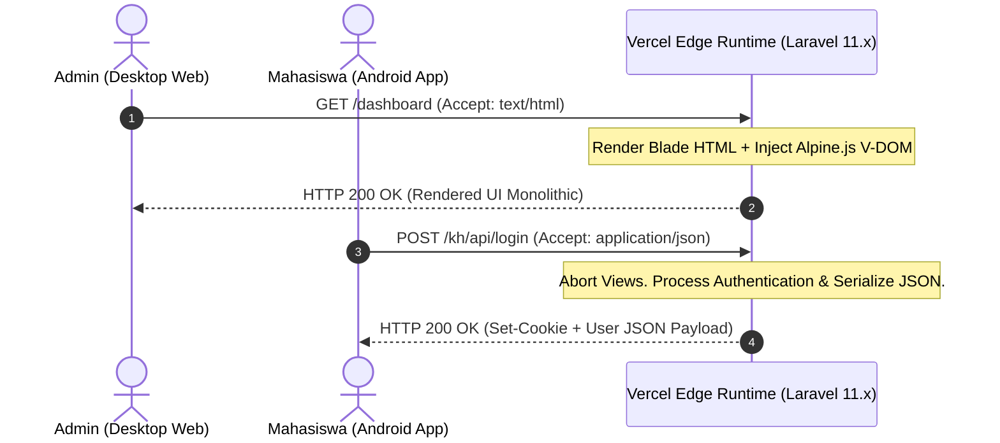

# 🧠 Arsitektur Teknis Sistem Mendalam (System Architecture Deep Dive)

**Konteks Layanan Aplikasi**: KelasHUB Hybrid (Vercel Core - TiDB Data - Kotlin Clients)  
**Terakhir Diulas**: Rilis *Sprint v2.3.0*

Dokumen rujukan ini merinci kerangka belakang mikroskopis (under the hood) KelasHUB. Diperuntukkan secara mutlak bagi perekayasa perangkat lunak Tingkat Lanjut (*Senior Engineers*). 

Menembus dinding batasan perangkat keras awan gratis (*Free Tier Cloud*), arsitektur monolith web diracik untuk berganti-ganti wajah menyesuaikan diri sebagai **HTML Dashboard** dan/atau **API JSON Socket** secara instan (Stateful Hibrida) bergantung pada siapa yang memanggilnya.

---

## 1. Anatomi Fondasi "The Hybrid Stateless Monolith"

Alur komputasi dipaksa bertransformasi ekstrem ketika berjalan di **Vercel Edge Network**: Segala aktivitas RAM Node.js & PHP dibunuh *(Terminated)* per ~10-detik batas Request Timeout. Ekosistem wajib beroperasi bagaikan prajurit Amnesia *(Pure-Stateless)* namun melayani dua panglima yang kontradiktif (Browser Web & Aplikasi Android Kotlin Murni).

### A. Rendering Monolitik Asinkron (Web Layer)
Target platform Administrator Kampus *(Desktop)*. 
- **Arsitektur Tampilan Dapur (Blade-Tailwind-Alpine Fusion)**: Halaman dilukis satu kali di belakang awan (*Server-Side Rendered Blade*). Setelah jendela dipancarkan, semua interaksi (Popup Tambah Tugas, Filter Warna, Hover Button) bergerak di-injeksi otonom oleh kode **Alpine.js v3** sehingga situs terasa *100% Reload-free SPA* (Singel Page App). Estetika antarmuka mengacu mutlak ke gelap *Stealth Zinc-900 (TailwindCSS v4)*.

### B. Mutasi Soket API Android (Payload JSON Murni)
- **Transformasi Otonoma Instan**: Vercel Router menyuntikkan alat deteksi. Jika sistem menyadari muatan Header `Accept: application/json` dari injeksi gawai Retrofit Android, **Kernel Laravel merontokkan segala produksi kode pandang (Views Balikan HTML)** dan langsung berubah menembak balik *Collection JSON Endpoint Mentah*. Arsitektur revolusioner ini menghemat memori pembuatan peladen microservices terpisah.



---

## 2. Paradigma Penyelesaian Kutukan Vercel Storage & OOM Limit

### Konflik Resolusi Kematian RAM *(OOM - Out of Memory)*
Ketika Bendahara berambisi membundel Ekspor 30,000 Transaksi Arus Uang ke File Excel, `Eloquent ORM model::all()` akan menyulap Data SQL MySQL menjadi barisan koleksi Obyek besar di Memory Linux. **RAM 128MB Vercel akan meledak saat itu juga (Error 500 Out of Memory Limit Exceeded).**

**Rekayasa Penyelematan Data Arus-Keping (0-RAM Stream Exporter Engine)**:
Pengembang mendesain ulang controller panggil (Bypass Eloquent Module). Kode menjejalkan MySQL Raw Data Streams dengan metode `DB::Table()->lazy()` yang memotong SQL 500 baris, mengonversinya menjadi balok teks CSV per karakter koma, kemudian melontarkannya langsung lewat penyangga `php://output` *(Browser download flush buffer)*. Nol persen memori RAM sistem terbeban!

### Konflik Kelumpuhan Diska Lokal (File Read-Only Ban)
Sistem Penyimpanan statis PDF Tugas Universitas lumpuh karena OS Vercel tidak akan pernah mengizinkan fail disimpan secara abadi. Sesudah mati tertidur, semua PDF mahasiswa musnah dalam kuburan direktori `/storage/app`.

**Rekayasa Pelarian Awan (Base64 Cloud RDBMS Injection)**:  
Makalah unggahan *(Multipart File)* diambil-alih sebelum masuk memori diska. Serpihan struktur *Biner* (.pdf) diobrak-abrik dan disuntik (Encoded) ke pembuluh String raksasa **`Base64`**. Formasi Huruf Acak jutaan abjad ini disimpan damai selamanya membatu di TiDB MySQL Kolom `LONGTEXT`. Tautan hilang 404 hancur musnah. Solusi permanen dan abadi.

---

## 3. Isolasi Dinding Tenant Tingkat-Multi Siber (IDOR Shielding Level 4)

Bahaya kerentanan Insecure Direct Object Reference (IDOR) amat fatal di aplikasi SaaS multikampus *(Cross-Tenant Server Model)*. Modifikasi permintaan `GET /delete/19` milik Mahasiswa kelas Z berpotensi me-reset Kelas A yang bersebelahan.

**Penyelesaian Global Trait Injection Enforcement**:
Setiap entitas Operasional (Kehadiran, Tugas, Laporan Kas, Jadwal), saat menginisialisasi pembacaan memori (Model `boot()` lifecycle), secara kaku diijeksikan *Trait Modul Pelindung Scopes Database*. Arsitektur Laravel akan menyematkan perintah kueri MySQL `WHERE 'class_id' = Identitas_Sesi_User_Login` ke semua pintu perintah DB.
Mustahil sebuah celah membiarkan penyusup memanggil obyek luar teritorinya. Eksekutor pelindung berposisi di dalam Jantung Model Skema Eloquent (Server Level Filtering).

```mermaid
graph TD
    User(Penyusup / Mahasiswa Nakal) -.->|Inject URL ?id=50 (Bukan Punya Dia)| Gateway(Edge Route)
    Gateway --> Middleware[Auth Cookie Validation]
    Middleware --> Control[Resource Controller Action]
    Control -->|Minta 1 Data Temuan| ORM[Model Scope Boot 'BelongsToClass']
    ORM -->|Penyisipan Otomatis Paksa| SQLQuery["Query Tersembunyi: SELECT * FROM cash.. WHERE ID=50 AND CLASS_ID=Identitas Kelas Nakal!"]
    SQLQuery -->|Mutlak Nol Hasil| Shield[/Throw HTTP 404 / 403 Forbidden Access/]
    
    style Shield fill:#e11d48,stroke:#333,stroke-width:2px,color:#fff
    style ORM fill:#059669,stroke:#333,stroke-width:2px,color:#fff
```

---

## 4. Mekanika Pelatuk Penyiaran Asinkron Radar (OneSignal Mobile Push Broadcast)

Modul **NotificationService.php** merupakan reaktor terpisah penyedia fungsi guncangan radar tanpa jeda (*Zero-Delay Background Signals*) untuk Mahasiswa Kotlin Klien Android.

1. **Jalur Bawah Otomasi**: Mahasiswa tidak mengetik atau mendaftar UID Notifikasi. Sesaat Ikon App ditekan pada Android HP mereka, *OneSignal Backend Daemon SDK V5* menyantol dan menyeret *(Generate)* Tanda Unik UUID (Player-ID).
2. **Asinkron Token Injeksi (POST /kh/device-token)**: UUID tersebut diselundupkan dan disinkronisasi paksa melintasi *Router JSON* KelasHUB dan dikunci disebelah nomor induk Nama User di SQL Cloud.
3. **Pemicu Darurat**: Pejabat merlis "Daftar Denda". Mesin Vercel menangguhkan balasan antarmuka Web beberapa sepersekian detik untuk meluncurkan Panggilan Transmisi *Rest API Guzzle Curl POST HTTP* keluar awan berisikan peluru Payload Kumpulan *(include_subscription_ids)* UUID Mahasiwa Kelas. API OneSignal membombardir Cloud Messaging Service Android merobek diam layar gawai serentak!
